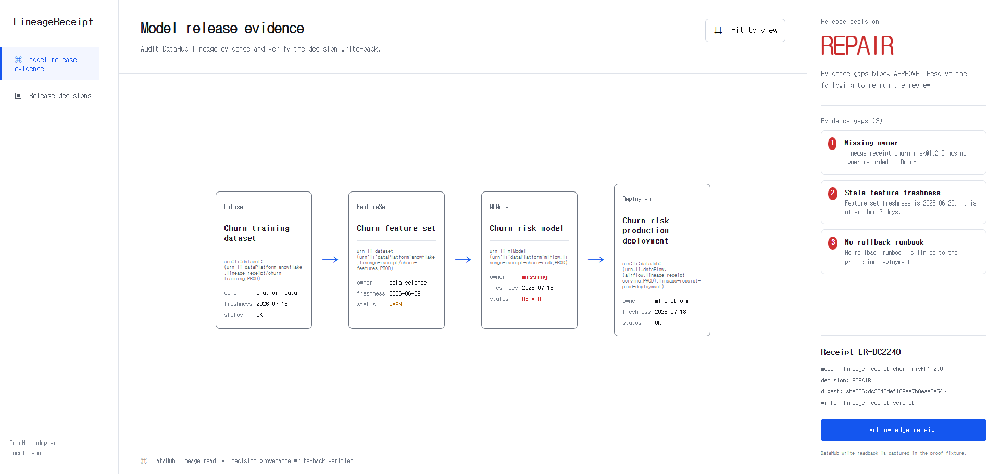

# LineageReceipt

An evidence-first ML release agent for OpenAI Build Week 2026 (Developer Tools) and the DataHub Agent Hackathon, built with Codex and GPT-5.6. It reads a model's DataHub lineage, blocks incomplete releases, and produces a cryptographic SHA-256 digest over a canonical evidence snapshot plus the resulting gap IDs before writing decision provenance back to DataHub. The DataHub entry uses the official `mcp-server-datahub` over MCP stdio for the read path; the pre-existing OpenAI submission and synthetic-fixture boundary are disclosed below.

## Current proof

`engine/release-audit.mjs` is a deterministic release rule engine. `scripts/datahub_roundtrip.py` uses the official DataHub SDK to upsert a synthetic ML graph, read its lineage, compute the same SHA-256 digest over the canonical evidence snapshot plus decision gaps, and persist the decision as ML model custom properties. Missing or invalid freshness evidence fails closed as `REPAIR`; the committed fixture is covered by cross-engine consistency and digest-binding tests. No production credentials are stored in this repository.



The screenshot is the current public evidence console: four DataHub URNs lead to the intentional `REPAIR / LR-DC2240` result, three named evidence gaps, and the matching SHA-256 receipt. It is a product readback, not a mock marketing graphic.

## Run

```bash
npm install
npm run dev
npm test
```

## DataHub round-trip proof

The browser UI runs with Node.js 20.19+ (or 22.12+); the round-trip adapter requires Python
3.11+ and the pinned SDK in `requirements.txt`. From a clean checkout:

```bash
python -m venv .venv
# macOS/Linux: source .venv/bin/activate
# Windows PowerShell: .venv\Scripts\Activate.ps1
python -m pip install --upgrade pip
python -m pip install -r requirements.txt
```

Start a DataHub Quickstart instance, then initialize the CLI token outside this
repository (`datahub init --username datahub --password datahub`) and run:

```bash
python scripts/datahub_roundtrip.py --write-decision
```

The command prints JSON containing the DataHub input/output URNs, model training
run, deployment job, deterministic receipt, and the write-back property. The
fixture is synthetic and contains no personal or production data.

The supported judge path is a local DataHub Quickstart on a modern desktop
browser with Docker available. No account credentials are needed for the
synthetic fixture; the CLI token is stored in the user's local DataHub config,
never in this repository.

## DataHub Agent Hackathon MCP proof

The DataHub-specific path is a real MCP client call, not a README claim:
`scripts/datahub_mcp_audit.py` starts the official `mcp-server-datahub`
process, checks that `get_entities` and `get_lineage` are advertised, reads all
fixture URNs through those tools, hashes each tool response, and feeds the
readback into the same deterministic receipt engine. DataHub versions that do
not expose process-instance aspects report the exact fallback fields; missing
entities or a missing server remain visible as
`MCP_READ_SUCCESS_WITH_WARNINGS` or `MCP_UNVERIFIED` and never become an
approval.

Install the pinned server dependency in the same virtual environment as the
SDK, then run the MCP proof after DataHub Quickstart is healthy:

```powershell
python -m pip install -r requirements.txt
datahub docker quickstart
# Set DATAHUB_GMS_URL and DATAHUB_GMS_TOKEN from your local Quickstart config.
python scripts/datahub_roundtrip.py --write-decision
python scripts/datahub_mcp_audit.py > mcp-audit.stdout.json
```

The last command launches `uvx mcp-server-datahub@0.6.0` itself as the MCP
subprocess, so the judge can reproduce the exact protocol boundary. If the package is installed as a
console script instead, use
`python scripts/datahub_mcp_audit.py --server-command mcp-server-datahub`.
The output is the evidence artifact: it includes the server handshake, the
advertised tool list, per-call response hashes, the MCP-derived lineage, and
the resulting `REPAIR` receipt. No token is printed or committed.

### Eligibility and category

The first repository commit is dated 2026-07-19, within the DataHub
submission period that began 2026-07-06. The earlier OpenAI Build Week entry is
disclosed rather than hidden; the DataHub-specific MCP adapter and proof path
are new work in this submission period. We target the **Production ML Agents**
category because the agent makes a release decision from model lineage and
evidence, rather than merely displaying metadata. See the official
[DataHub hackathon rules](https://datahub.devpost.com/rules) for the new-project,
Apache-2.0, public-demo, and category requirements.

Licensed under Apache-2.0.

## OpenAI Build Week provenance

LineageReceipt is a developer tool built during the July 2026 OpenAI Build Week
submission period with Codex and GPT-5.6. Codex drove the
implementation loop, browser readback, and regression checks; GPT-5.6 was used
for product framing, rule design, and adversarial review of the evidence
boundary. The key design decision was to keep `REPAIR` visible when owner,
freshness, or rollback evidence is missing instead of manufacturing an
approval.

For judges, the fastest path is:

1. Open the live demo at <https://016lineage-receipt.vercel.app>.
2. Read the four URNs, the three explicit gaps, and the `REPAIR / LR-DC2240` SHA-256 receipt. The `REPAIR` state is intentional: the tool refuses to approve missing owner, stale freshness, or absent rollback evidence.
3. Run `npm test` and `npm run build` locally.
4. Run `python scripts/datahub_roundtrip.py --write-decision` against a local
   DataHub Quickstart to reproduce the lineage read and decision write-back;
   the command fails if the persisted verdict, receipt ID, or SHA-256 digest
   does not match the computed receipt.

The Python safety/fixture tests can be run independently with
`python scripts/test_datahub_roundtrip.py` after the pinned SDK install.

The fixture is synthetic and non-sensitive. The public repository is licensed
under Apache-2.0.
